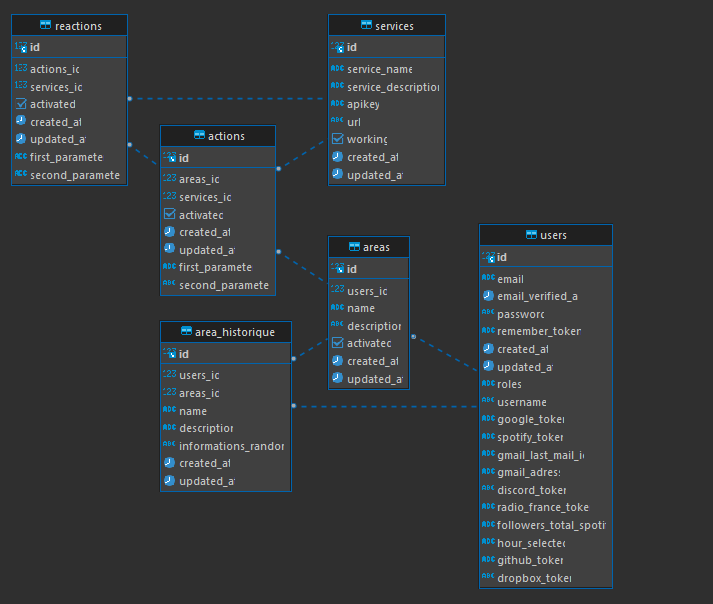
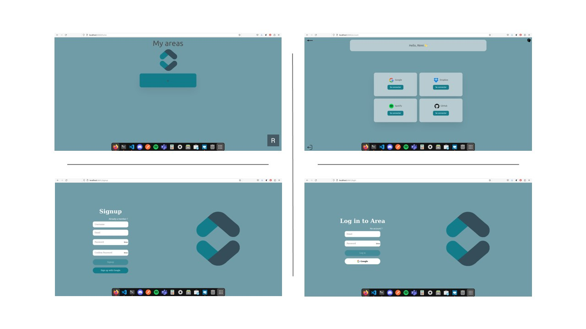
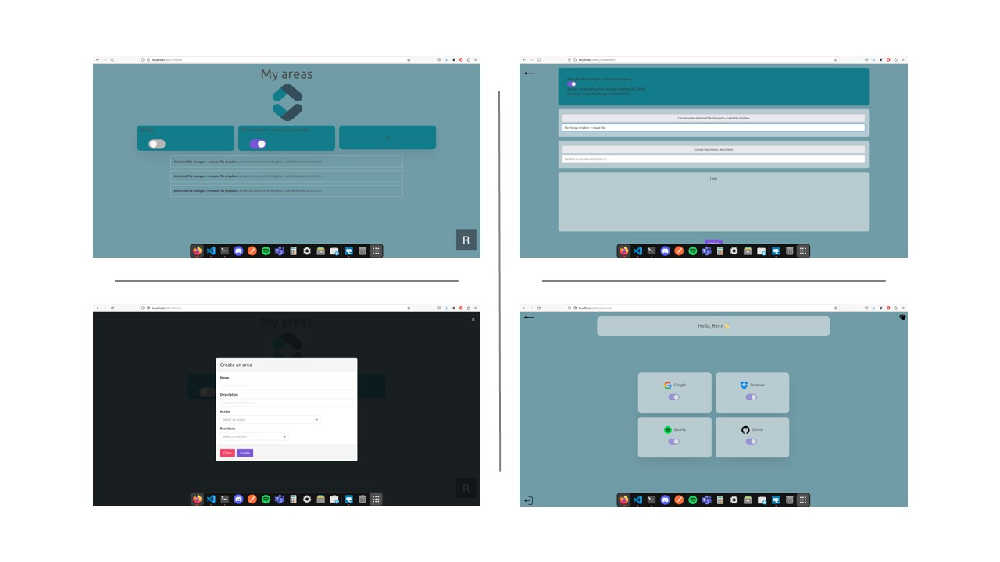

# AREA


## Project overview

The AREA project consists in the creation of a software suite that functions similarly to IFTTT.
This software suite is a divided into 3 parts:

- A server to implement all the features.
- A web application to use the app from a browser.
- A mobile application to use the app from a phone.

## Technical choices

This project is developped using theses technologies:

- Server = Laravel  
- Database = PostgresSQL  
- Front WEB = VueJS  
- Mobile = Swift  

## Organization tools
- Jira  
- Discord  
- Github (with mirroring)  

## Backend UML



## Usage of website app




## Usage of mobile app


## Documentation
> Api Backend [link](https://documenter.getpostman.com/view/20779056/2s9YJc1hgo).

## Folder architecture

We have 3 subprojects in this repository:
- Server (under `Back`) which act as the master node of the application. It contains
  all the logic of the actions and reactions.
- Website front-end (under `Front/WEB`) which expose a website to interact with the AREA.
- Mobile front-end (under `Front/MOBILE`) which expose a mobile application to interact with
  the AREA.

## How to use

This project use __Docker__ and __docker-compose__ to be served:

```bash
$ docker-compose up -d --build
```

If you don't have docker, you can follow theses instructions :

In the folder /Back/:
```bash
$ php artisan serve
```

In the folder /Front/WEB/:
```bash
$ npm run dev   
```

### Made by:  
- [Gautier Bonhur](https://github.com/gautier337) - Back-end developer  
- [Rémi Maigrot](https://github.com/RemiMaigrot) - Back-end developer    
- [Max Peixoto](https://github.com/MaxPeix) - Web client developer  
- [Hugo Dubois](https://github.com/Hugo-code-dev) - Web client developer / Mobile client developer 
- [Timoté Franck](https://github.com/NameIsDume) - Mobile client developer  