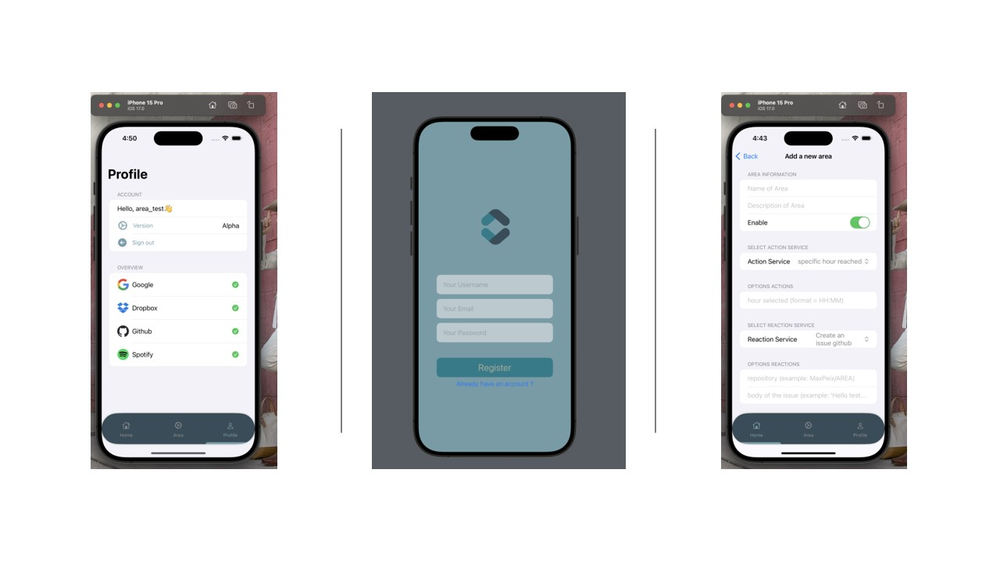
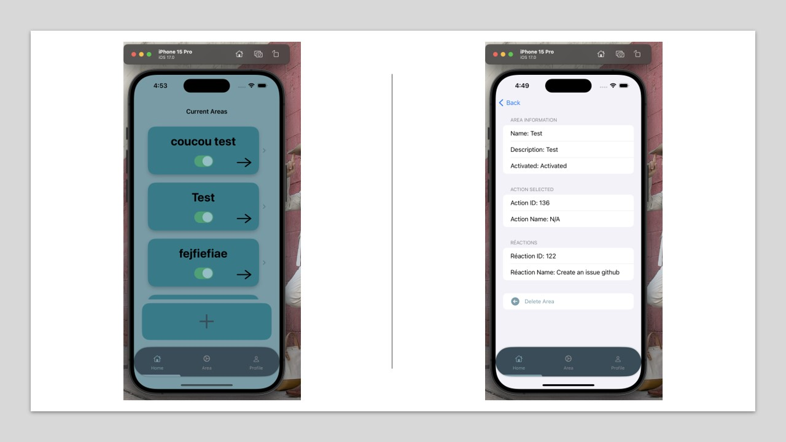

# AREA


## Project overview

The AREA project consists in the creation of a software suite that functions similarly to IFTTT.
This software suite is a divided into 3 parts:

- A server to implement all the features.
- A web application to use the app from a browser.
- A mobile application to use the app from a phone.

## Technical choices

This project is developped using theses technologies:

- Server = Laravel  
- Database = PostgresSQL  
- Front WEB = VueJS  
- Mobile = Swift  

## Organization tools
- Jira  
- Discord  
- Github (with mirroring)  

## Backend UML


## Usage of website app


## Usage of mobile app




## Documentation
> Api Backend [link Postam API](https://documenter.getpostman.com/view/20779056/2s9YJc1hgo).

Protocol create service in area application:

1. Go to Database postgreSQL and add new line on table "services" width ID / service_name with [ACTION] or [REACTION] at the end / service_description / apiKey (optional) / url (optional) / working (true)
2. Go to the file "main_to_check_for_all_the_actions" / "main_to_check_for_all_reactions" and add your service (example):
```php
            // voir si il y a un nouveau commit
            if ($action->service->id == 19) {
                $exitCode = Artisan::call('app:check_for_new_commit', [
                    'user' => $user->id,
                    'action_id' => $action->id
                ]);

                if ($exitCode === 0) {
                    Artisan::call('app:main_to_execute_reactions', [
                        'action' => $action->id,
                        'user' => $user->id,
                        'area_name' => $area->name
                    ]);
                }
            }
```
3. Create your file ("main_to_execute_reactions") in the folder
/Back/app/Console/Commands/ (example):
```php
<?php

namespace App\Console\Commands;

use Illuminate\Console\Command;
use Illuminate\Support\Facades\Http;
use App\Models\User;
use Illuminate\Support\Facades\Log;
use Illuminate\Support\Facades\Cache;
use App\Models\Action;

class check_for_new_issue extends Command
{
    protected $signature = 'app:check_for_new_issue {user} {action_id}';
    protected $description = 'Check for new issues on a GitHub repository';

    public function handle()
    {
        $user = $this->argument('user');
        $action_id = $this->argument('action_id');
        $action = Action::find($action_id);
        $user = User::find($user);
        $repository = $action->first_parameter;
        if (!$repository) {
            Log::info('Repository not found');
            return 1;
        }
        $token = $user->github_token;
        Log::info("token : " . $token);

        $url = "https://api.github.com/repos/$repository/issues";

        $response = Http::withHeaders([
            'Accept' => 'application/vnd.github.v3+json',
            'Authorization' => "Bearer $token",
        ])->get($url);

        if ($response->failed()) {
            Log::info('Failed to fetch issues from GitHub.');
            return 1;
        }

        $issues = $response->json();
        $latestIssueId = $issues[0]['id'] ?? null;

        if (!$latestIssueId) {
            Log::info('No issues found.');
            return 1;
        }

        $lastCheckedIssueId = $action->second_parameter;

        if ($latestIssueId == $lastCheckedIssueId) {
            Log::info('No new issues.');
            return 1;
        } else {
            Log::info('New issue detected: ' . $latestIssueId);
            $action->second_parameter = $latestIssueId;
            $action->save();
            return 0;
        }
    }
}
```
4. If you want add some parameters to your service, go to
/Back/app/Http/Controllers/ControllerServices.php and put your parameters (example):
```php
            } else if (strpos($serviceNameLower, 'new issue') !== false) {
                $services[$i]['options'] = [
                    "repository (example: MaxPeix/AREA)",
                ];
```
5. You can manage users's error input in /Back/app/Http/Controllers/ControllerAreas (example):
```php
            if ($request->service_reaction_id == 23) {
                if ($request->config[2] == null) {
                    if (strlen($request->config[2]) > 35 || strlen($request->config[2]) < 1) {
                        return response()->json(['message' => 'Invalid new title of file'], 401);
                    }
                }
            }
```

## Folder architecture

We have 3 subprojects in this repository:
- Server (under `Back`) which act as the master node of the application. It contains
  all the logic of the actions and reactions.
- Website front-end (under `Front/WEB`) which expose a website to interact with the AREA.
- Mobile front-end (under `Front/MOBILE`) which expose a mobile application to interact with
  the AREA.

## How to use

This project use __Docker__ and __docker-compose__ to be served:

```bash
$ docker-compose up
```

### Made by:  
- [Gautier Bonhur](https://github.com/gautier337) - Back-end developer  
- [Rémi Maigrot](https://github.com/RemiMaigrot) - Back-end developer    
- [Max Peixoto](https://github.com/MaxPeix) - Web client developer  
- [Hugo Dubois](https://github.com/Hugo-code-dev) - Web client developer / Mobile client developer 
- [Timoté Franck](https://github.com/NameIsDume) - Mobile client developer  